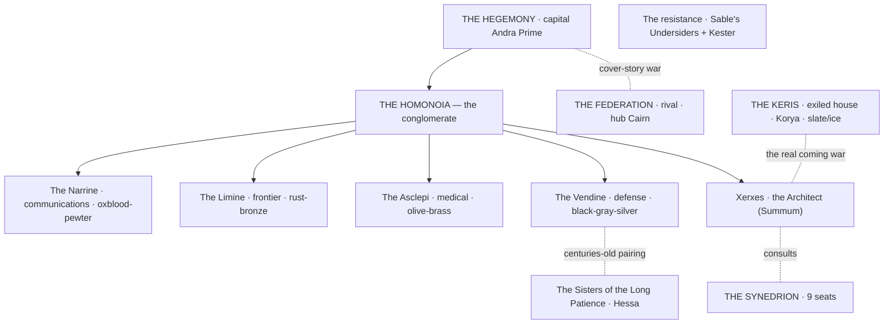
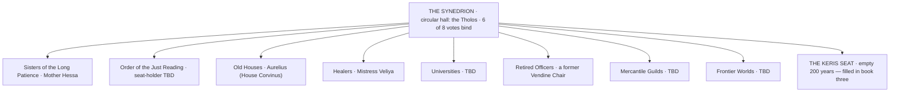
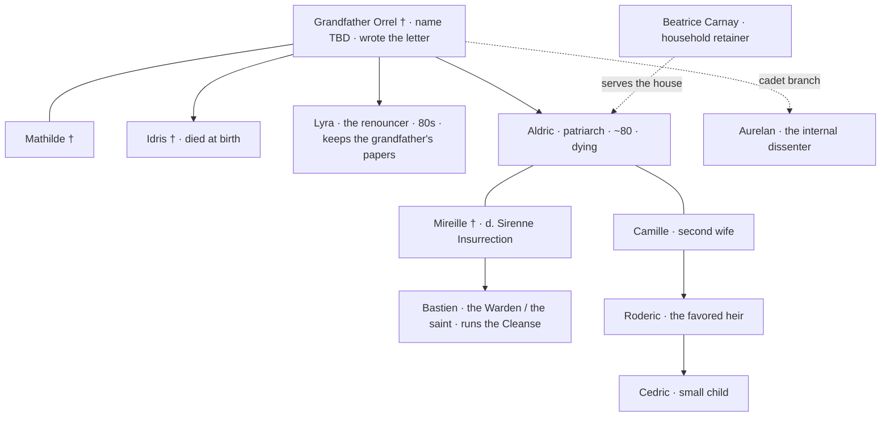
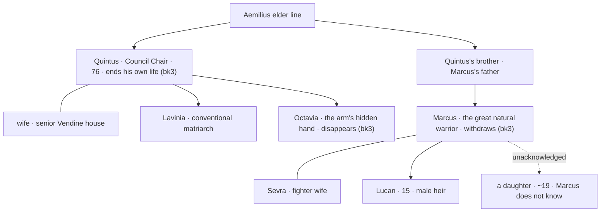
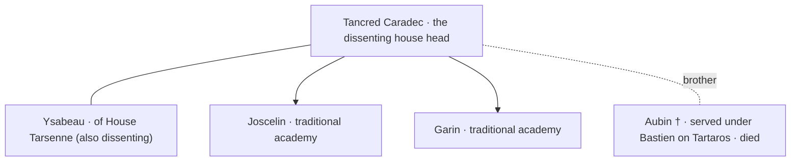
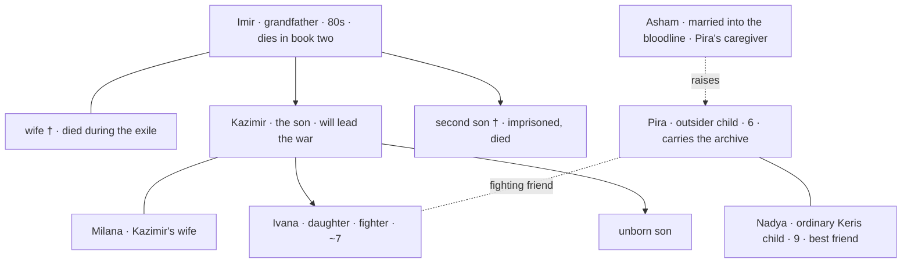
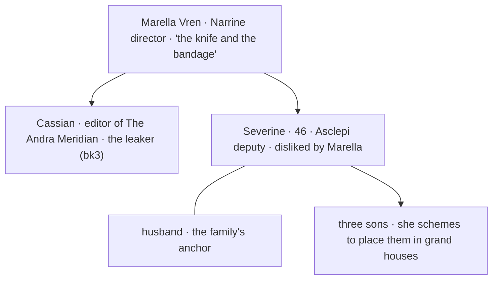
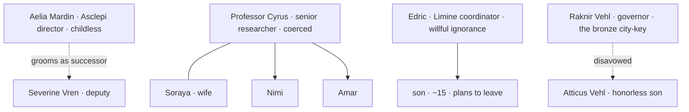
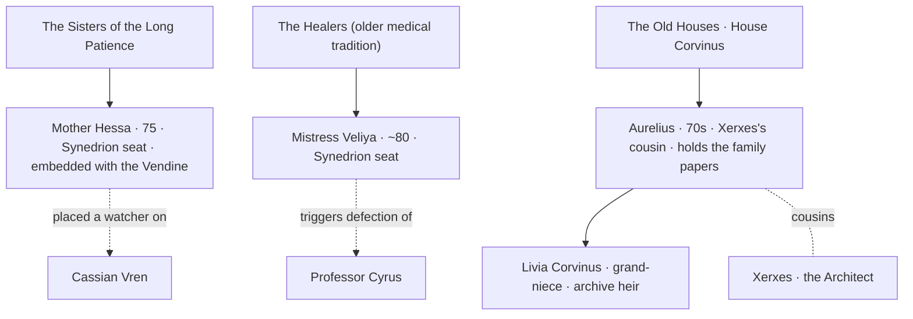
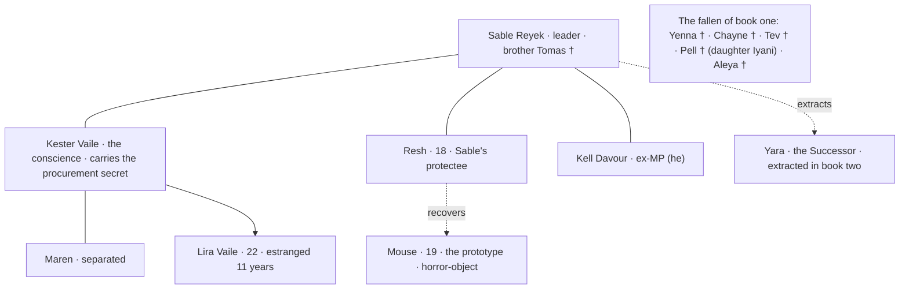

# The Tartaros Cycle — Character Map

*Who's who, grouped by house and faction, with small family trees and relations —
so the whole cast can be seen at a glance. Diagrams are Mermaid; in VS Code use a
Markdown preview (the **Markdown Mermaid** extension from `SETUP.md` renders them).
Detail lives in `../bible/TARTAROS_CYCLE_BIBLE.md`.*

**Legend:** † = deceased · solid line = marriage or parent→child · dotted line =
other relation (service, friendship, mentorship, etc.).

---

## 1. The powers and the Homonoia

## 2. The Synedrion — nine seats (the Tholos)

---

## 3. House Orrel — senior Vendine house

## 4. House Aemilius — senior Vendine house

## 5. House Caradec — the dissenting Vendine house

---

## 6. The Keris of Korya — the exiled bloodline

---

## 7. The Narrine (communications) — the Vren family

## 8. The Asclepi (medical) and the Limine (frontier)

---

## 9. The Sisters, the Healers, and the Old Houses

---

## 10. The resistance and the fallen (book one)

---

*Companion files: `../bible/TARTAROS_CYCLE_BIBLE.md` (full canon),
`../bible/TRILOGY_SYNOPSIS.md` (the story and its locked ending),
`../bible/TARTAROS_QUESTIONS.md` (character tracker — closed).*
